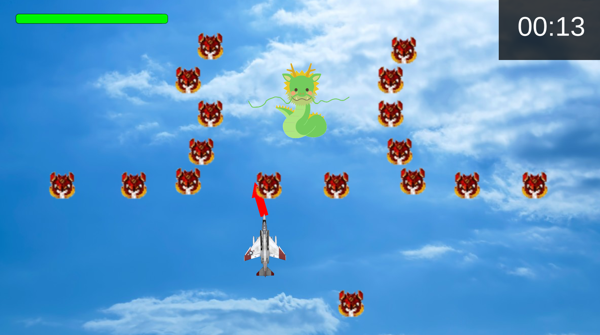

# ゲームジャム概要
- 大学研究室開催(非公式)
- 時間：10:00 - 20:00
- テーマ：ふれる
# ゲーム内容
## プレイ画面

## 概要
- 基本的には自機が敵に当たるとゲームオーバー
- ただし、自機が敵の竜の逆鱗に"ふれる"とゲームクリア
- 周りの雑魚は弾を発射して倒す
- 弾は一定間隔ごとに1発ずつしか撃てない(左上のゲージがたまったら撃てる)
- ただし、発射される方向は振り子のように"ふれて"いる(矢印で示す)
## 操作
- マウスクリック：弾発射
- 「w, a, s, d」：自機移動
- 「Enter」：ゲーム開始、リザルトから初期画面への遷移
